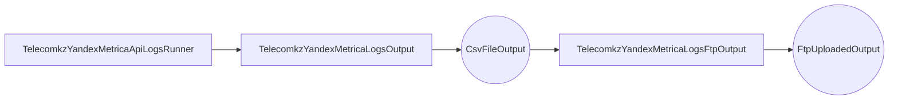

Классы, которые наследуются от TelecomkzYandexMetricaRepsRunner, являются задачами в рамках проекта, который использует библиотеку luigi для автоматизации задач. Эти задачи получают свои параметры из файлов YAML, используя имена задач в качестве ключей.


В сдучае telecom, задачи обычно наследуются: 
1.TelecomkzYandexMetricaRepsRunner 
2.TelecomobkzYandexMetricaRepsRunner 
3.TelecomkzYandexMetricaApiLogsRunner 
4.TelecomkzYandexMetricaLogsRunner

Обрабатывают данные из API Яндекс.Метрика. Они получают информацию о концепции API, параметрах запроса и обрабатывают результаты, преобразуя их в формат CSV для последующей обработки.


В данном проекте следующие классы наследуются от TelecomkzYandexMetricaLogsRunner:

1. Класс TelecomobkzYandexMetricaLogsProfiles: Эта задача обрабатывает данные о профилях пользователей, таких как профили в приложении Telecomkz. 

Ссылка: https://api.appmetrica.yandex.ru/logs/v1/export/profiles.csv

Документация: https://appmetrica.yandex.ru/docs/ru/mobile-api/logs/endpoints#profiles

Класс-структура:

```python
class TelecomobkzProfileLogRow:
    appmetrica_crashes = field(default='')
    appmetrica_first_session_date = field(default='')
    appmetrica_last_start_date = field(default='')
    appmetrica_sessions = field(default='')
    appmetrica_device_id = field(default='')
    device_model = field(default='')
    os_version = field(default='')
    app_version_name = field(default='')
    customerId = field(default='')
```

Запуск из контейнера:

```bash
docker-compose -f docker-compose.home.yml run --rm job luigi --module telecomkz TelecomobkzYandexMetricaLogsProfiles
```  

2.
TelecomobkzYandexMetricaLogsCrushes: Эта задача обрабатывает данные о критических событиях, таких как падения приложений или устройств.

Ссылка: https://api.appmetrica.yandex.ru/logs/v1/export/crashes.csv

Документация: https://appmetrica.yandex.ru/docs/ru/mobile-api/logs/endpoints#crashes

Класс-структура:

```python
class TelecomobkzCrashLogRow:
    crash = field(default='')
    crash_datetime = field(default='')
    crash_group_id = field(default='')
    crash_id = field(default='')
    crash_name = field(default='')
    appmetrica_device_id = field(default='')
```

Запуск из контейнера:

```bash
docker-compose -f docker-compose.home.yml run --rm job luigi --module telecomkz TelecomobkzYandexMetricaLogsCrushes
```  

3.
TelecomobkzYandexMetricaLogsEvents: Эта задача обрабатывает данные о различных событиях, таких как запуск приложений или устройств.

Ссылка: https://api.appmetrica.yandex.ru/logs/v1/export/events.csv

Документация: https://appmetrica.yandex.ru/docs/ru/mobile-api/logs/ref/events

Класс-структура:

```python
class TelecomobkzEventLogRow:
    event_datetime = field(default='')
    event_json = field(default='')
    event_name = field(default='')
    event_receive_datetime = field(default='')
    session_id = field(default='')
    installation_id = field(default='')
    appmetrica_device_id = field(default='')
    profile_id = field(default='')
```

Запуск из контейнера:

```bash
docker-compose -f docker-compose.home.yml run --rm job luigi --module telecomkz TelecomobkzYandexMetricaLogsEvents
```  

TelecomobkzYandexMetricaRepsRunner: 

1.
TelecomobkzYandexMetricaRepsAcquisitions: Эта задача обрабатывает данные о конверсиях и реферальных ссылках.

Ссылка: https://api.appmetrica.yandex.ru/v2/user/acquisition.csv

Документация: 

Класс-структура:

```python
class TelecomobkzRepAcquisitionsRow:
    date = field(default='')
    os = field(default='')
    install_count = field(default='')
```

Запуск из контейнера:

```bash
docker-compose -f docker-compose.home.yml run --rm job luigi --module telecomkz TelecomobkzRepAcquisitionsRow
```  

2.
TelecomobkzYandexMetricaRepsDau:

Ссылка: https://api.appmetrica.yandex.ru/stat/v1/data.csv

Документация: https://appmetrica.yandex.com/docs/en/mobile-api/api_v1/data

Параметры метрики: ym:u:activeUsers,norm(ym:u:activeUsers),ym:u:newUsers,norm(ym:u:newUsers),ym:u:newUsersShare

Класс-структура:

```python
class TelecomobkzRepDauRow:
    date = field(default='')
    active_users_count = field(default='')
    active_users_share = field(default='')
    new_users_count = field(default='')
    new_users_share = field(default='')
```

Запуск из контейнера:

```bash
docker-compose -f docker-compose.home.yml run --rm job luigi --module telecomkz TelecomobkzRepDauRow
```  

3.
TelecomobkzYandexMetricaRepsEvents: Эта задача обрабатывает данные о конверсиях и реферальных ссылках для конкретной аудитории.

Ссылка: https://api.appmetrica.yandex.ru/stat/v1/data.csv

Документация: https://appmetrica.yandex.com/docs/en/mobile-api/api_v1/data

Параметры метрики: ym:ce2:allEvents,norm(ym:ce2:allEvents),ym:ce2:devicesWithEvent,norm(ym:ce2:devicesWithEvent),ym:ce2:eventsPerDevice,ym:ce2:devicesPercent

Класс-структура:

```python
class TelecomobkzRepEventRow:
    date = field(default='')
    event_name = field(default='')
    event_comment = field(default='')
    events_count = field(default='')
    events_share = field(default='')
    devices_with_events_count = field(default='')
    devices_with_events_share = field(default='')
    events_per_device_count = field(default='')
    devices_percent = field(default='')
```

Запуск из контейнера:

```bash
docker-compose -f docker-compose.home.yml run --rm job luigi --module telecomkz TelecomobkzYandexMetricaRepsEvents
```  


Следующие классы наследуются от TelecomkzYandexMetricaRepsRunner: 

1.
TelecomkzYandexMetricaRepsMainVisits: ...

Ссылка: https://api.appmetrica.yandex.ru/stat/v1/data.csv

Документация: https://appmetrica.yandex.com/docs/en/mobile-api/api_v1/data

Параметры метрики: ym:s:visits

Класс-структура:

```python
class TelecomkzMainVisitsRow:
    date = field(default='')
    sess_count = field(default='')
```

Запуск из контейнера:

```bash
docker-compose -f docker-compose.home.yml run --rm job luigi --module telecomkz TelecomkzYandexMetricaRepsMainVisits
```  

2.
TelecomkzYandexMetricaRepsLK1Visits: ...

Ссылка: https://api.appmetrica.yandex.ru/stat/v1/data.csv

Документация: https://appmetrica.yandex.com/docs/en/mobile-api/api_v1/data

Параметры метрики: ym:s:visits

Класс-структура:

```python
class TelecomkzLK1VisitsRow:
    date = field(default='')
    sess_count = field(default='')
```

Запуск из контейнера:

```bash
docker-compose -f docker-compose.home.yml run --rm job luigi --module telecomkz TelecomkzYandexMetricaRepsLK1Visits
```  

3.
TelecomkzYandexMetricaRepsLK2Visits: ...

Ссылка: https://api.appmetrica.yandex.ru/stat/v1/data.csv

Документация: https://appmetrica.yandex.com/docs/en/mobile-api/api_v1/data

Параметры метрики: ym:s:visits

Класс-структура:

```python
class TelecomkzLK2VisitsRow:
    date = field(default='')
    sess_count = field(default='')
```

Запуск из контейнера:

```bash
docker-compose -f docker-compose.home.yml run --rm job luigi --module telecomkz TelecomkzYandexMetricaRepsLK2Visits
```  


В данном проекте следующие классы наследуются от TelecomkzYandexConversionsMetricaRepsOutput: 

1.
TelecomkzYandexConversionsMetricaRepsMain: ...

Ссылка: https://api.appmetrica.yandex.ru/stat/v1/data.csv

Документация: https://appmetrica.yandex.com/docs/en/mobile-api/api_v1/data

Параметры метрики: ym:s:goal{0}conversionRate,ym:s:goal{0}reaches,ym:s:goal{0}visits,ym:s:goal{0}converted<currency>Revenue,ym:s:goal{0}users,ym:s:goal{0}pageviews,ym:s:goal{0}percentNewVisitors,ym:s:goal{0}bounceRate,ym:s:goal{0}pageDepth,ym:s:goal{0}avgVisitDurationSeconds,ym:s:visits

Класс-структура:

```python
class TelecomkzConversionsMainRow:
    conversion_id = field(default='')
    conversion_title = field(default='')
    date = field(default='')
    conversion_rate = field(default='')
    reaches = field(default='')
    visits = field(default='')
    converted_rub_revenue = field(default='')
    users = field(default='')
    page_views = field(default='')
    percent_new_visitors = field(default='')
    bounce_rate = field(default='')
    page_depth = field(default='')
    avg_visit_duration_seconds = field(default='')
    visits1 = field(default='')
```

Запуск из контейнера:

```bash
docker-compose -f docker-compose.home.yml run --rm job luigi --module telecomkz TelecomkzYandexConversionsMetricaRepsMain
```  

2.
TelecomkzYandexConversionsMetricaRepsLK1: ...

Ссылка: https://api.appmetrica.yandex.ru/stat/v1/data.csv

Документация: https://appmetrica.yandex.com/docs/en/mobile-api/api_v1/data

Параметры метрики: ym:s:goal{0}conversionRate,ym:s:goal{0}reaches,ym:s:goal{0}visits,ym:s:goal{0}converted<currency>Revenue,ym:s:goal{0}users,ym:s:goal{0}pageviews,ym:s:goal{0}percentNewVisitors,ym:s:goal{0}bounceRate,ym:s:goal{0}pageDepth,ym:s:goal{0}avgVisitDurationSeconds,ym:s:visits

Класс-структура:

```python
class TelecomkzConversionsLK1Row:
    conversion_id = field(default='')
    conversion_title = field(default='')
    date = field(default='')
    conversion_rate = field(default='')
    reaches = field(default='')
    visits = field(default='')
    converted_rub_revenue = field(default='')
    users = field(default='')
    page_views = field(default='')
    percent_new_visitors = field(default='')
    bounce_rate = field(default='')
    page_depth = field(default='')ф
    avg_visit_duration_seconds = field(default='')
    visits1 = field(default='')
```

Запуск из контейнера:

```bash
docker-compose -f docker-compose.home.yml run --rm job luigi --module telecomkz TelecomkzYandexConversionsMetricaRepsLK1
```  
